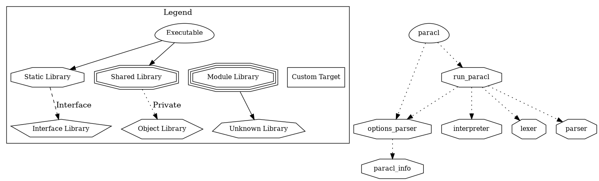
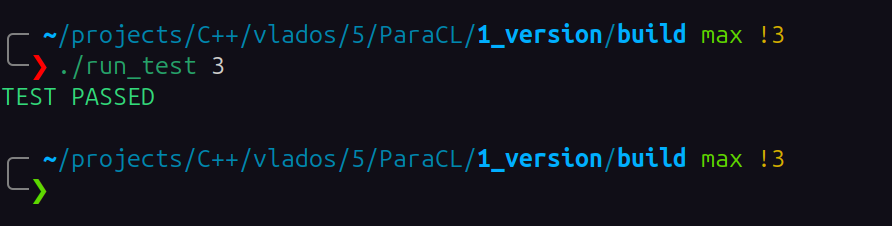
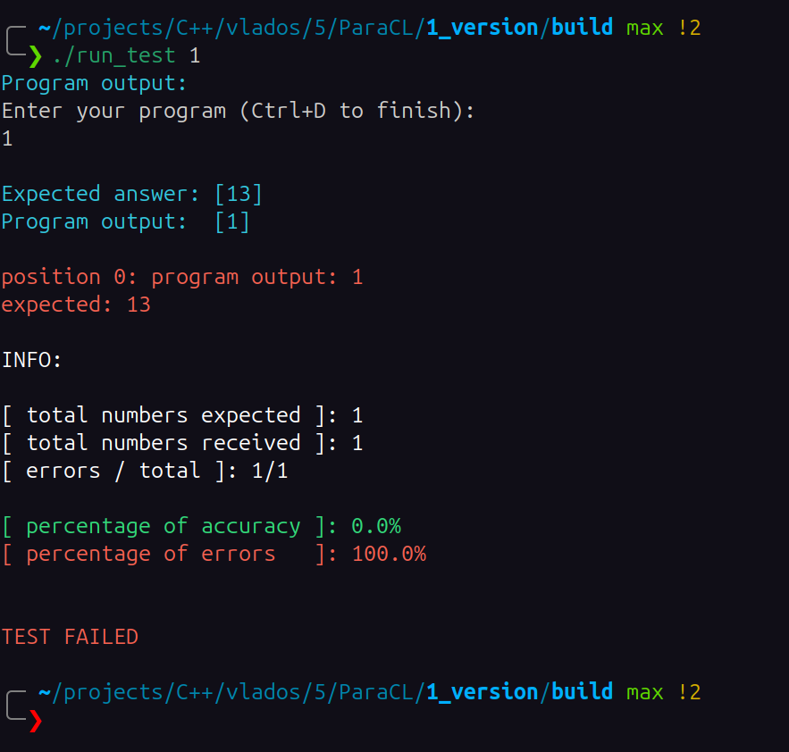

# ParaCL (младший брат С, калека, интерпретируемый язык программирования)


# По поводу Windows и MSVC


# Зависимости:
[flex](https://github.com/westes/flex)\
[bison](https://web.mit.edu/gnu/doc/html/bison_7.html)
 
Для удобной работы понадобятся следующие инструменты:

## Для комплиляции:
[clang++](https://clang.org/)\
[g++](https://gcc.gnu.org/)\
`clang` рекомендуется для данного проекта, так как на момент написания проекта он лучше умеет работать с `.cppm` модулями.

## Для сборки:
[cmake](https://cmake.org/ "ссылка на официальный сайт cmake")\
[ninja](https://ninja-build.org "ссылка на оффициальный сайт ninja")\
`Ninja` рекомендуется для данного проекта, так как в большистве пакетных менеджеров поставляется версия, для которой `cmake` умеет работать с модулями (`.cppm`).

Вот что про это говорит сам `cmake`:
```bash
Modules are supported only by Ninja, Ninja Multi-Config, and Visual Studio
generators for VS 17.4 and newer.  See the cmake-cxxmodules(7) manual for
details.  Use the CMAKE_CXX_SCAN_FOR_MODULES variable to enable or disable
scanning.
```


# Установка:
```bash
git clone https://github.com/Matvey787/ParaCL --recurse-submodules
cd ParaCL
```

# Сборка:
Если поддреживается bash или совместимый аналог:
```bash
bash start.sh
```
Иначе (релизная сборка по умолчанию):
```bash
cmake -S . -B build
cmake --build build
```

Рекомендуется явно указать `Ninja` и `clang++`:
```bash
cmake -S . -B build -G Ninja -DCMAKE_CXX_COMPILER=clang++
```


# Использование:
*из папки build*
Чтобы передать текст программы через `stdout`:
```bash
./paracl
# paracl ожидает ввод текста программы с stdout
```

Чтобы передать программу через файлы:
```bash
./paracl <1>.pcl <2>.pcl  ... 
```

Чтобы получить помощь по использованию `ParaCL`:
```bash
./paracl --help
./paracl -h
```
Чтобы получить текущую версию `ParaCL`, установленную на Вашем устройстве:
```bash
./paracl --version
./paracl -v
```


**ВАЖНО: `ParaCL`, как уважающий себя язык имеет собственно расширение: `.pcl`. Файл с другим расширением программой на `ParaCL` являться НЕ может!**


# Информация для контрибьютеров и соразаботчиков:
Структура проекта:
```txt
.
├── start.sh
├── debug-start.sh
├── README.md
├── assets
│   └── no-msvc.PNG
├── CMakeLists.txt
├── cmake
│   ├── debug.cmake
│   ├── dep
│   │   ├── check-bison.cmake
│   │   ├── check-flex.cmake
│   │   └── global.cmake
│   └── tests
│       ├── e2e
│       │   ├── add-e2e-to-target-function.cmake
│       │   └── e2e-paracl-python-script.cmake
│       └── unit
├── debug
│   ├── in
│   │   └── run_test.sh.in
│   └── parse_program_output
│       └── parse_result.py
├── include
│   └── global
│       ├── custom_console_output.hpp
│       └── global.hpp
├── project_struct
│   └── project_struct.txt
├── src
│   ├── back
│   │   └── src
│   │       └── parser.y
│   ├── front
│   │   ├── inc
│   │   │   └── lexer.hpp
│   │   └── src
│   │       └── lexer.l
│   ├── main.cpp
│   ├── options_parser
│   │   └── options_parser.cppm
│   └── paracl
│       ├── paracl_extension.cppm
│       ├── parse_paracl_exit_code.cppm
│       └── run_paracl.cppm
├── tests
│   └── e2e
│       ├── ans
│       │   ├── 0001.ans
│       │   ├── ...
│       │   └── 0010.ans
│       └── dat
│           ├── 0001.pcl
│           ├── ...
│           └── 0010.pcl
└── third-party
    └── logger
        ├── assets
        ├── examples
        │   └── header-only
        │       ├── CMakeLists.txt
        │       └── test.cpp
        ├── README.md
        └── Src
            ├── header-only
            │   ├── custom_console_output.hpp
            │   ├── global.hpp
            │   ├── log_background_settings.hpp
            │   └── pineaplog.hpp
            └── modules-based
                ├── cmake
                │   └── debug.cmake
                ├── CMakeLists.txt
                ├── include
                │   ├── global
                │   │   ├── custom_console_output.hpp
                │   │   └── global.hpp
                │   └── logger
                │       └── log_background_settings.hpp
                └── src
                    └── log.cppm

38 directories, 58 files
```

# Зависимости между библиотеками:



# Дебаг
Для дебажной сборки предоставлен скрипт `debug-start.sh`
```bash
bash debug-start.sh
```

Так же в дебажной сборке доступен скрипт `build/run_test`, для запуска e2e-теста с определенным номером, который атоматически генерируется `cmake` при опции `BUILD_TESTING`:
```bash
./run_test 1
./tun_test 4
```

Результат парсится специльным python-скриптом:

\
- пример удачного теста


- пример неудачного теста

<br>

Так же поставляется [логгер](https://github.com/Maksim-Sebelev/logger) по умолчанию. Он доступен в программе при сборке с опцией `LOGGER` (включена в `debug-start.sh`). Подробнее о нем можно прочитать в его официальном [репозитории](https://github.com/Maksim-Sebelev/logger).
